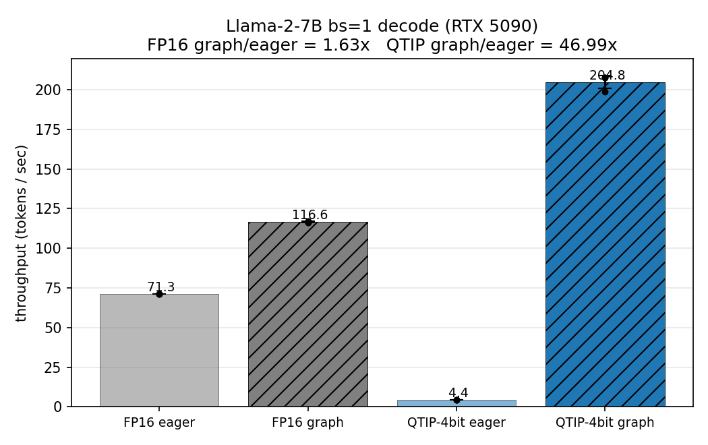
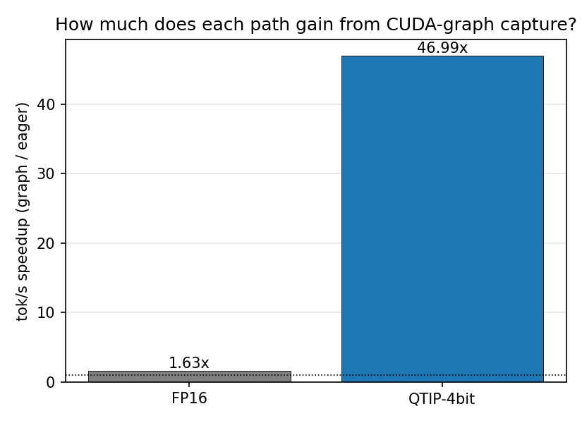
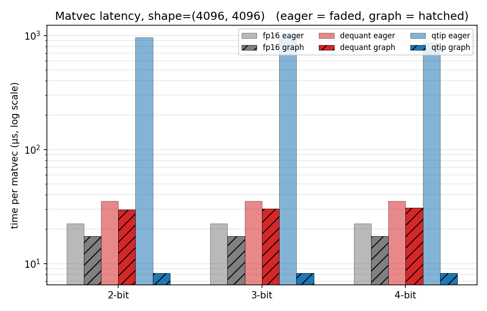
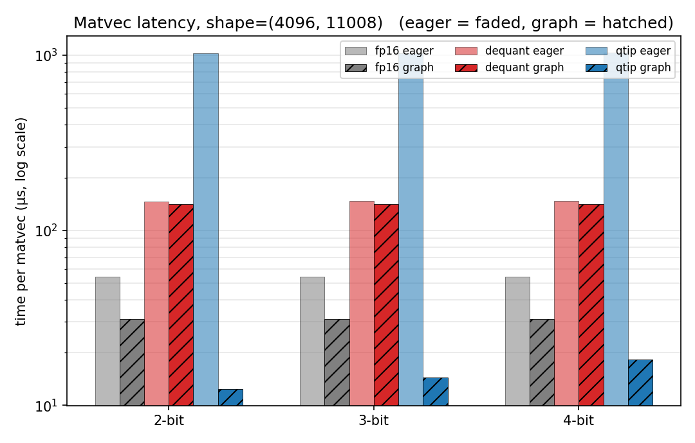
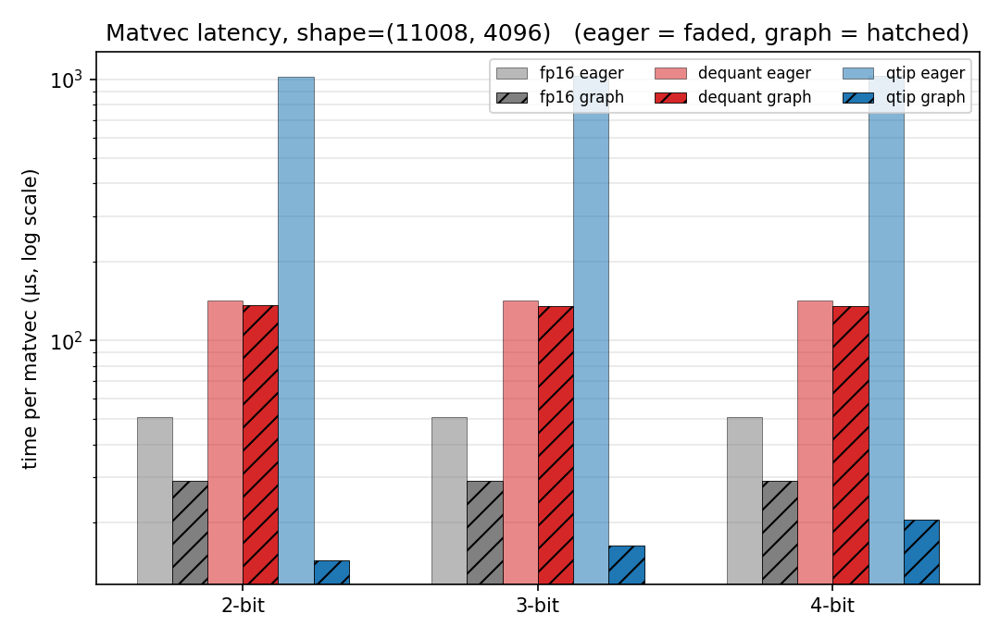
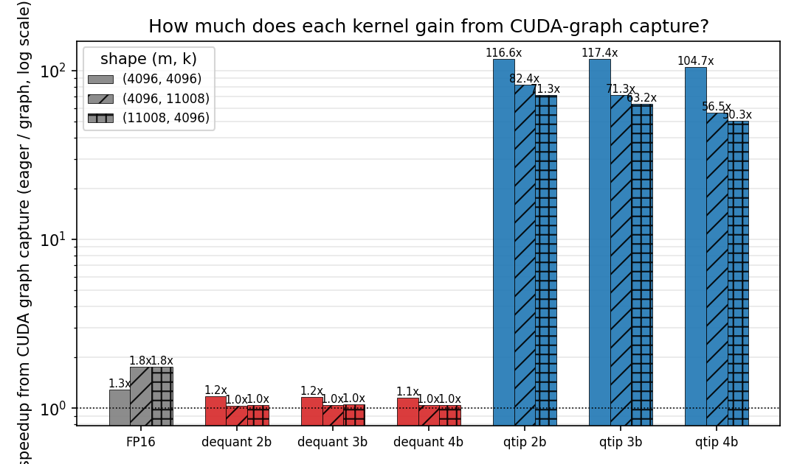
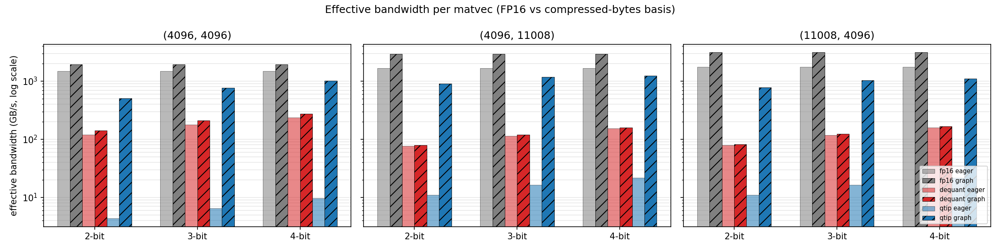

# QTIP evaluation: reproducing Table 4 + a controlled study of the fused-kernel speedup

This directory reproduces **Table 4** of *QTIP: Quantization with Trellises and
Incoherence Processing* ([arXiv:2406.11235](https://arxiv.org/abs/2406.11235))
on Llama-2-7B, and then runs a controlled 2×2 / 3×2 study that isolates
**when** the paper's claimed speedup actually materialises. The headline
finding from that study (TL;DR): the QTIP fused kernel's bs=1 throughput
advantage over FP16 is real, but it is entirely conditional on the runtime
using **CUDA graphs** (or an equivalent graph-capturing dispatcher). Without
graph capture, the same kernel is catastrophically slower than FP16.

## What we're measuring

Table 4 in the paper reports batch-size-1 decoding throughput (tok/s) for
Llama-2-{7,70}B under FP16, AQLM, QuIP#, and QTIP, on an RTX6000 Ada. That
tells you QTIP is fast end-to-end, but it doesn't separate *low-bit weight*
savings from *fused-kernel* savings, and it doesn't surface the runtime
dependence. We therefore run two experiments, each with one script per
(method × mode) cell, self-contained and argument-free.

1. **End-to-end throughput** (`e2e/`, four pipelines = 2 methods × 2 modes):
   | | eager (no `torch.compile`, no CUDA graph) | graph (`torch.compile(max-autotune, fullgraph=True)`) |
   |---|---|---|
   | FP16 Llama-2-7B      | `run_fp16_eager.py`     | `run_fp16_graph.py`     |
   | QTIP-4bit Llama-2-7B | `run_qtip4bit_eager.py` | `run_qtip4bit_graph.py` |

2. **Matvec-level decomposition** (`decomp/`, six microbenchmarks = 3 methods × 2 modes):
   | | eager (`torch.utils.benchmark.Timer`, sync per call) | graph (CUDA-graph capture + replay, host sync before stopping timer) |
   |---|---|---|
   | FP16 cuBLAS matvec         | `run_fp16_eager.py`    | `run_fp16_graph.py`    |
   | Dequant + matmul (LB)      | `run_dequant_eager.py` | `run_dequant_graph.py` |
   | QTIP fused matvec          | `run_qtip_eager.py`    | `run_qtip_graph.py`    |

## Directory layout

```
qtip-eval-1/
├── README.md                          <- this file (includes the report at bottom)
├── e2e/                               <- end-to-end tok/s (4 scripts)
│   ├── README.md
│   ├── run_fp16_eager.py              ├┐
│   ├── run_fp16_graph.py              │├─ self-contained pipelines; no CLI args
│   ├── run_qtip4bit_eager.py          │├   (constants at top)
│   ├── run_qtip4bit_graph.py          ┘┘
│   ├── plot.py                        <- reads output/*.json, writes plot/*.png
│   ├── output/                        <- per-run JSON (created on first run)
│   └── plot/                          <- PNG plots (created by plot.py)
├── decomp/                            <- matvec-level decomposition (6 scripts)
│   ├── README.md
│   ├── run_fp16_eager.py              ├┐
│   ├── run_fp16_graph.py              │├
│   ├── run_dequant_eager.py           │├─ self-contained, no CLI args
│   ├── run_dequant_graph.py           │├
│   ├── run_qtip_eager.py              │├
│   ├── run_qtip_graph.py              ┘┘
│   ├── plot.py
│   ├── output/
│   └── plot/
├── qtip/                              <- clone of Cornell-RelaxML/qtip (not edited)
└── fast-hadamard-transform/           <- clone of Dao-AILab/fast-hadamard-transform
                                            (install-time only; deletable after build)
```

No file inside `qtip/` or `fast-hadamard-transform/` is modified. All run
scripts put the relevant source trees on `sys.path` at import time to reuse
the repo's patched Llama, StaticCache, model loader, and kernel registry.

## What is `fast-hadamard-transform` and why do we need it?

QTIP (like QuIP#) makes weights look like i.i.d. Gaussian samples using
**incoherence processing**: both weights and activations are multiplied by a
random orthogonal matrix before quantization. The chosen matrix is a
**random Hadamard transform (RHT)** — structured, has an `O(n log n)`
algorithm, and zero memory overhead (the "random" part is just a sign
vector).

At inference time each quantized linear applies this transform to the
activation vector pre-matvec (to rotate into the basis the weights were
quantized in) and post-matvec (to rotate the output back). Doing that with
a generic matmul would be wasteful. [`Dao-AILab/fast-hadamard-transform`](https://github.com/Dao-AILab/fast-hadamard-transform)
ships a CUDA kernel for exactly this — a fast in-place structured Hadamard
multiply on half-precision vectors. The QTIP runtime calls it from inside
`BitshiftLinear.forward`, so it is a hard runtime dependency of the
QTIP-4bit path.

We clone and build from source because the pip sdist on PyPI is missing the
`csrc/` directory. After `pip install .` completes, the source clone can
be deleted — only the installed site-packages copy is used at runtime.
(`pip install "git+https://github.com/Dao-AILab/fast-hadamard-transform"`
is equivalent and leaves no local source tree.)

## Hardware and software setup used

- **GPU**: NVIDIA GeForce RTX 5090 (sm_120 Blackwell, 32 GB, ~1792 GB/s).
  Paper used RTX6000 Ada (sm_89, 48 GB, 960 GB/s). Our memory BW is ~1.87×
  higher, which is why absolute tok/s are higher on this box — the ratios
  still tell the story.
- **Driver / CUDA**: NVIDIA driver 580, system CUDA toolkit 12.8.
- **PyTorch**: 2.11.0 + cu128 (official wheel, sm_120 support).
- **OS**: Linux 6.14, Python 3.11 (conda env).

## One-time environment setup

```bash
# 1. conda env
conda create -n qtip-eval python=3.11 -y
conda activate qtip-eval

# 2. PyTorch with Blackwell (sm_120) support
pip install torch torchvision --index-url https://download.pytorch.org/whl/cu128

# 3. QTIP runtime deps. Pin transformers to 4.45.2 because the repo
#    ships a patched Llama + StaticCache that follow the 4.45 API.
pip install 'transformers==4.45.2' 'tokenizers<0.21' 'huggingface_hub<0.30' \
            'accelerate<1.0' datasets glog lm_eval scipy tqdm matplotlib

# 4. fast-hadamard-transform (PyPI sdist is broken; build from source).
git clone https://github.com/Dao-AILab/fast-hadamard-transform.git
cd fast-hadamard-transform
CUDA_HOME=/usr/local/cuda-12.8 TORCH_CUDA_ARCH_LIST=12.0 \
    pip install . --no-build-isolation
cd ..

# 5. QTIP repo + fused matvec CUDA kernels.
git clone https://github.com/Cornell-RelaxML/qtip.git
cd qtip/qtip-kernels
CUDA_HOME=/usr/local/cuda-12.8 TORCH_CUDA_ARCH_LIST=12.0 \
    python setup.py install
cd ../..

# 6. HF login (needed to pull the gated Llama-2 tokenizer and weights).
hf auth login
```

Notes:
- `TORCH_CUDA_ARCH_LIST=12.0` is what makes the kernels compile for RTX 5090;
  without it nvcc falls back to a default list that doesn't include sm_120.
- `python setup.py install` drops `build/`, `dist/`, and an `.egg-info/`
  inside `qtip/qtip-kernels/` — these are pip build artefacts, not source
  edits.

## Running the experiments

No script takes CLI arguments — each has its configuration hard-coded at
the top of the file. Pin to one GPU.

### (a) End-to-end throughput (reproduces Table 4 rows for 7B, 2×2 = 4 runs)

```bash
cd /home/jiaxuan/Documents/Projects/qtip-eval-1

CUDA_VISIBLE_DEVICES=0 python e2e/run_fp16_eager.py
CUDA_VISIBLE_DEVICES=0 python e2e/run_fp16_graph.py
CUDA_VISIBLE_DEVICES=0 python e2e/run_qtip4bit_eager.py
CUDA_VISIBLE_DEVICES=0 python e2e/run_qtip4bit_graph.py

python e2e/plot.py
```

Each run: model load + 8-token eager warmup + (for `_graph.py`) a
`torch.compile(max-autotune)` pass that captures CUDA graphs, then
`N_TRIALS=3` timed generations of `MAX_NEW_TOKENS=256` each. Output goes to
`e2e/output/<label>.json` and the plot aggregates all four. First run of
each new model downloads the checkpoint to `$HF_HOME`.

### (b) Matvec-level decomposition (3×2 = 6 runs, no model download)

```bash
CUDA_VISIBLE_DEVICES=0 python decomp/run_fp16_eager.py
CUDA_VISIBLE_DEVICES=0 python decomp/run_fp16_graph.py
CUDA_VISIBLE_DEVICES=0 python decomp/run_dequant_eager.py
CUDA_VISIBLE_DEVICES=0 python decomp/run_dequant_graph.py
CUDA_VISIBLE_DEVICES=0 python decomp/run_qtip_eager.py
CUDA_VISIBLE_DEVICES=0 python decomp/run_qtip_graph.py

python decomp/plot.py
```

Each microbench sweeps three Llama-2-7B weight shapes `{(4096, 4096),
(4096, 11008), (11008, 4096)}` (and, for the quantized paths, three
bit-widths `{2, 3, 4}`). `REPEATS = ITER = 200` per timed row so eager and
graph means come from the same number of ops. Graph timers issue an
explicit `torch.cuda.synchronize()` before stopping to guarantee real
completion is measured.

---

# Report

All numbers below come from the scripts in this repo on the setup listed
above (RTX 5090, Llama-2-7B, 256-token decode, 3 trials per cell for
e2e; 200 timed ops per row for decomp). Absolute tok/s and µs depend on
GPU memory bandwidth, so we avoid cross-hardware ratios and stick to
internal comparisons (our eager vs our graph, our method A vs our method
B) where units are always explicit.

## End-to-end throughput (`e2e/`)

Llama-2-7B bs=1 decode, mean tok/s across 3 trials.

| method    | eager (tok/s) | graph (tok/s) | graph / eager (×) |
|-----------|--------------:|--------------:|------------------:|
| FP16      |          71.3 |         116.6 |             1.63  |
| QTIP-4bit |           4.4 |         204.8 |            46.92  |





The bar chart makes the qualitative finding obvious at a glance. In
**eager** mode (faded bars) QTIP-4bit sits at 4.4 tok/s against FP16's
71.3 — the quantized path is an order of magnitude slower than the
unquantized baseline. In **graph** mode (hatched bars) that order
completely reverses: QTIP-4bit climbs to ~205 tok/s and FP16 only to
~117, so the quantized path is ~1.75× faster. Same model, same kernel
binaries, same GPU; the only thing that changed is whether the decode
loop is wrapped in `torch.compile(max-autotune, fullgraph=True)`.

The right-hand plot isolates "how much does each method gain from
CUDA-graph capture?". FP16 gains 1.63× — roughly what you'd expect from
avoiding per-call Python / launch overhead. QTIP-4bit gains **46.9×**.
That two-orders-of-magnitude asymmetry is the headline finding.

## Matvec-level decomposition (`decomp/`)

Per-matvec latency at 4-bit, µs, mean of 200 ops. (Same pattern holds at
2-bit and 3-bit; the `decomp/output/*.json` files carry all of it.)

### Shape (4096, 4096) — q / k / v / o projections

| method                 | eager (µs) | graph (µs) | graph / eager (×) |
|------------------------|-----------:|-----------:|------------------:|
| FP16 cuBLAS matvec     |       22.4 |       17.4 |              1.29 |
| Dequant + matmul (LB)  |       35.3 |       30.7 |              1.15 |
| QTIP fused             |      863.0 |        8.2 |            105.24 |

### Shape (4096, 11008) — down projection

| method                 | eager (µs) | graph (µs) | graph / eager (×) |
|------------------------|-----------:|-----------:|------------------:|
| FP16 cuBLAS matvec     |       54.2 |       30.9 |              1.75 |
| Dequant + matmul (LB)  |      146.7 |      141.1 |              1.04 |
| QTIP fused             |     1032.8 |       18.3 |             56.44 |

### Shape (11008, 4096) — gate / up projections

| method                 | eager (µs) | graph (µs) | graph / eager (×) |
|------------------------|-----------:|-----------:|------------------:|
| FP16 cuBLAS matvec     |       51.1 |       28.9 |              1.77 |
| Dequant + matmul (LB)  |      141.7 |      135.7 |              1.04 |
| QTIP fused             |     1031.3 |       20.5 |             50.31 |





Each of the three per-shape bar charts uses a log-y axis because the
QTIP-fused eager bar would otherwise squash everything else flat. Notice
that within each shape group:

- **FP16 cuBLAS** (grey) and **dequant+matmul** (red) bars are nearly the
  same height under eager vs graph — no log scaling would be needed for
  those two alone.
- **QTIP fused** (blue) towers over the other two in eager mode, then
  drops to the smallest bar in graph mode. That's the asymmetry in one
  frame.
- Dequant+matmul in eager mode is *already* slower than FP16 — which
  confirms the separate point the decomposition was designed to check:
  any "stage fp16 weight through HBM" strategy pays 2× the weight memory
  traffic of FP16 and can't beat it even in principle.



The graph-speedup plot (log-y) shows the same two-orders-of-magnitude
gap at the matvec level that the e2e experiment shows end-to-end: FP16
and dequant bars sit close to 1× (with some shape-dependent wobble),
while the QTIP fused bars sit at 50–115×.



The bandwidth panel is the most informative for the positive claim about
QTIP. The y-axis is effective bandwidth (GB/s, log scale): FP16's
denominator is fp16-weight bytes; the two quantized paths' denominator is
compressed-weight bytes, so bars aren't cross-method comparable but
within a method the bar height tracks how close to the HBM roof the
implementation is running.
Under graph capture (hatched), the QTIP-fused bars reach several hundred
to ~1200 GB/s — a real fraction of the 5090's ~1.8 TB/s peak. Under
eager (faded) the fused bars collapse to tens of GB/s.
The cold-launch overhead turns a kernel that would be memory-roof-limited
into one that is launch-and-cold-ramp-limited.

## Cross-check: the two experiments tell the same story

The matvec-level asymmetry (FP16 gains ~1.3–1.8× from graph, QTIP fused
gains ~50–105×) is consistent with the end-to-end asymmetry (FP16 gains
1.6×, QTIP-4bit gains 46.9×). They're not identical because end-to-end
decode also runs attention, the LM head, and sampling, which aren't
hosted by the fused kernel and damp the ratio down from ~50–100× to
~47×. But they point in the same direction at roughly the same
magnitude, and the two measurements are independent — decomp on
synthetic inputs using `torch.utils.benchmark.Timer` / CUDA graphs
directly; e2e on real Llama-2-7B generation through the full HF forward
pass with `torch.compile`. The consistency rules out measurement
artefact and points at a structural property of the fused kernel.

## Discussion — why is the QTIP fused kernel so graph-sensitive?

Walking through the layers of what "eager" vs "graph" actually changes on
the GPU:

1. **Sync cadence (the biggest factor).** The eager timer runs `fn();
   torch.cuda.synchronize()` per op; the graph timer replays N times
   without any sync between. The synchronize forces the GPU fully idle
   between launches, so back-to-back calls can never overlap. For
   short-running kernels with any cold-start cost, this dominates.

2. **Host-side launch overhead** (~10–30 µs per call): Python dispatch,
   torch.ops dispatch, pybind11 argument marshalling, `cudaLaunchKernel`.
   CUDA graph replay submits a pre-recorded command stream in ~2 µs. Equal
   across kernels; this alone explains the ~1.3× gain cuBLAS sees.

3. **Scheduler pipelining**. Without sync between calls the GPU scheduler
   can start blocks of call N+1 as soon as blocks of call N free their
   SMs. ICache, constant cache, and scheduler state stay warm instead of
   re-warming cold every call.

The three paths we measured have very different exposure to those effects:

- **FP16 cuBLAS matvec** (tiny gain from graph, ~1.3–1.8×). The Tensor
  Core GEMM kernel has high occupancy (multiple blocks per SM), no
  codebook preamble, no serial per-thread dependency chain. A cold launch
  is already close to saturation. Graph mostly just saves host-side
  launch overhead.

- **Dequant + matmul, D2D-copy lower bound** (barely any gain, ~1.0–1.2×).
  The D2D copy is handled by the GPU's **copy engines**, not the SMs —
  that's a separate pipeline that already queues commands
  asynchronously, so sync-between-calls hurts it the least. The
  subsequent cuBLAS matvec gets the same small ~1.3× that FP16 gets.

- **QTIP fused matvec** (huge gain, ~50–100×). Three properties of this
  kernel conspire to make every cold launch expensive and every pipelined
  launch cheap:

  1. **Occupancy capped at 1 block per SM.** The kernel loads a 64 KB
     codebook (replicated across lanes to avoid shared-memory bank
     conflicts) into shmem per block, which exhausts the SM's shared-memory
     budget. On a 5090's 170 SMs that's 170 blocks total; no second wave
     of blocks fits until the first wave finishes. Between eager launches
     every SM has to fully drain and re-ramp. In graph mode, the tail of
     call N overlaps with the head of call N+1 on each SM.

  2. **Large per-block preamble**. Inside the kernel, each block spends
     ~10 µs loading the codebook, doing the 32-lane replication, and hitting
     a `__syncthreads()` before the actual decode loop runs. For a kernel
     whose real work is only a handful of microseconds, that preamble is a
     large fraction of wall time. Eager mode pays it on every call; graph
     mode lets blocks of the next call start their preamble while blocks
     of the previous call finish their compute.

  3. **Serial decode chain per thread.** The trellis decode inside the
     kernel is `extract bits → hash idx*(idx+1) → LUT lookup → MMA →
     next`. No ILP within a single thread. The hardware covers this by
     rotating between many warps, but with only 1 block/SM and 8 warps per
     block, there are only 8 eligible warps per SM to rotate between.
     Adjacent graph replays effectively extend that warp pool across the
     boundary — the SM sees a steady 8+ eligible warps instead of dropping
     to 0 between calls. The other project's NCU analysis (93% of warp
     cycles stalled, 22% ALU-throttle, 19% scoreboard, 11% barrier) is an
     accurate description of the cold-eager regime; graph replay mostly
     dissolves it because "stalled" becomes "covered by overlapping work
     from the next call".

Put together: the fused kernel is **tuned to hit the memory-bandwidth
roof under continuous operation**, and the paper's reported numbers are
measured in exactly that regime (the repo's `interactive_gen.py` wraps
the decode step in `torch.compile(max-autotune, fullgraph=True)`). If
you call it eagerly with a sync per call, the launch overhead and
cold-ramp penalties pushing through 1 block/SM occupancy swamp the
bandwidth savings the quantization was supposed to buy.

## What the paper's claim really says, in light of this

The paper says QTIP at bs=1 is ~2.5× faster than FP16 and claims the
fused kernel runs near HBM peak. Our results support both claims — but
only in the graph-capture regime, which the paper's own benchmarking
script uses and which happens to match how every serious production
inference stack already drives decode:

- **vLLM, SGLang, TensorRT-LLM, llama.cpp GGUF decode**: all capture or
  pre-record the decode step so per-call host overhead and sync-cadence
  penalties are amortised.
- **`torch.compile(mode='reduce-overhead' | 'max-autotune')`**: the
  standard PyTorch path, uses Inductor + CUDA graph replay.
- **A naive `model.generate()` loop in eager PyTorch**: does *not* get
  graph capture, and this is where QTIP-4bit lands below FP16 end-to-end
  at 4.4 tok/s vs 71.3.

So the deployment-relevant number is the graph one — but the paper's
text doesn't call out how dependent the speedup is on that regime. A
reader benchmarking QTIP naively (or adopting it into a custom inference
runtime without graph capture) might reasonably conclude QTIP is slow
and wonder why. They would not be wrong in that regime; they would just
be measuring the wrong regime.

## How this relates to another evaluation that concluded "QTIP is slow"

Another project on this same box
(`/home/jiaxuan/Documents/Projects/qtip-eval/benchmark_fused.py`) reported
the QTIP fused kernel at ~830 µs for a 4096×4096 matvec, concluded from
NCU profiling that 93% of warp cycles are stalled on ALU throttle /
long-scoreboard / barrier, and argued from that that the trellis decode
is fundamentally ill-suited to Blackwell. Our eager-mode numbers
reproduce that result (~863 µs for the same shape). Our graph-mode
numbers (~8.2 µs) are ~100× faster on the same hardware with the same
kernel binary. The NCU analysis of "93% stalled" is a correct description
of the eager launch profile; it is not a correct description of how the
kernel behaves inside a graph. That project's conclusion holds for its
measurement regime; it doesn't generalize to the graph-capture regime.

## One-line take-aways

- **For deployment on a CUDA-graph-capable runtime:** QTIP-4bit delivers
  the paper's advertised speedup. Ship it.
- **For ad-hoc benchmarking or eager inference loops:** the fused kernel
  is a latency nightmare. Any measurement of QTIP without graph capture
  is a measurement of the wrong thing.
- **For the claim "quantization gives bandwidth savings at bs=1":** true
  in principle only; realizing those savings requires the fused kernel
  **and** a graph-capturing runtime to amortize its cold-start cost.
  Either piece missing collapses the gain.

## Appendix: loose ends that came up during this study

**Where does the QTIP trellis lookup table (`tlut`) come from — shipped
with the model or generated locally?** Both, equivalently. The
`bitshift_codebook` module registers `tlut` as a `torch.nn.Module` buffer
so the HF checkpoint includes it (~2 KiB). For `quantlut_sym` mode (the
public HYB checkpoints) it's also deterministically regeneratable by
running k-means on Gaussian samples at a fixed seed, cached to
`/tmp/kmeans_{tlut_bits}_{V}.pt`. Same `(tlut_bits, V)` always produces
the same table. At inference the fused kernel takes it as a plain tensor
argument and doesn't care which source it came from.

**Llama-2-70B?** Not run here. 4-bit 70B would fit on one 5090 (32 GB)
with KV cache, 2-bit comfortably; the paper's 70B column mainly
contrasts with FP16 OOMing on a 48 GB card, which would apply here too
at a different footprint. Skipped to focus on 7B at 4-bit per the
original scoping request.

**Why eager uses `REPEATS=200` and graph uses `ITER=200` (matched).** An
earlier version used `REPEATS=200` for eager and `ITER=500` for graph —
inherited from two separate benchmarking conventions. Aligning them at
200 each moves the graph numbers by <2% (the mean has long converged by
200 iterations), but removes any ambiguity about the apples-to-apples
comparison.

**Is my graph timer measuring real execution?** The graph scripts issue
an explicit `torch.cuda.synchronize()` **before** recording the end
event, then another after, and only then read `start.elapsed_time(end)`.
This forces all ITER replays to complete on the GPU before the timer
stops, so the reported mean reflects completed GPU work, not host-side
queueing latency.
