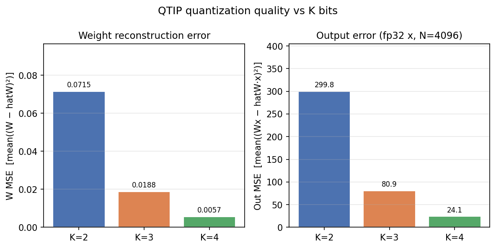
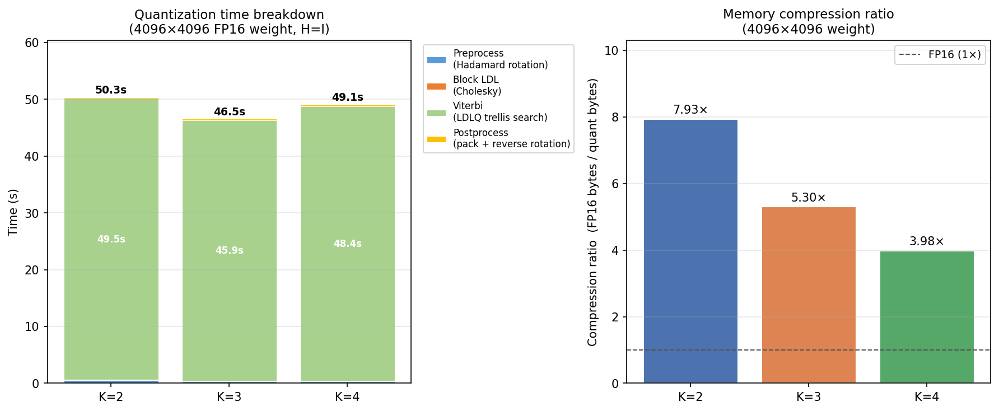
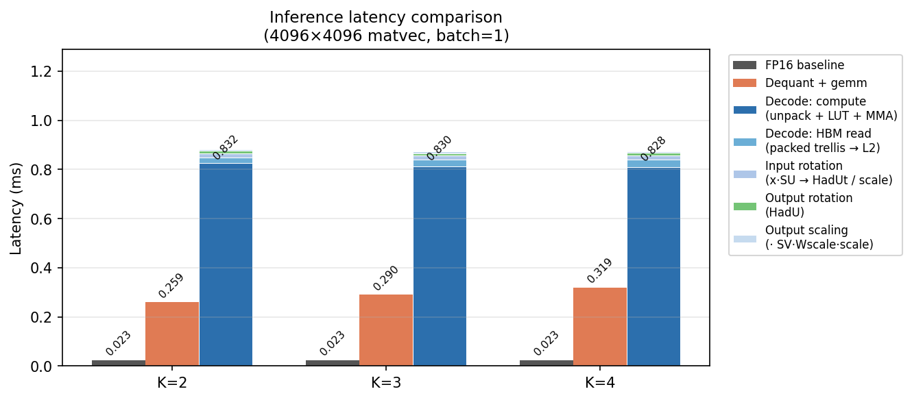
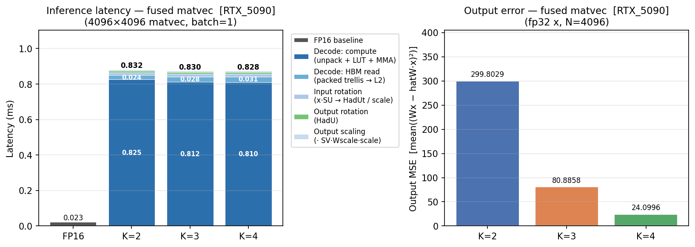
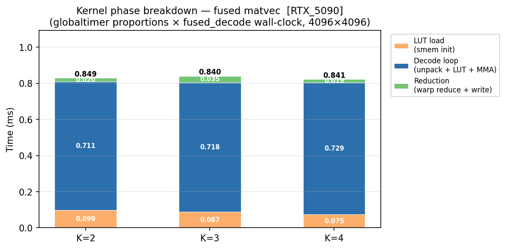
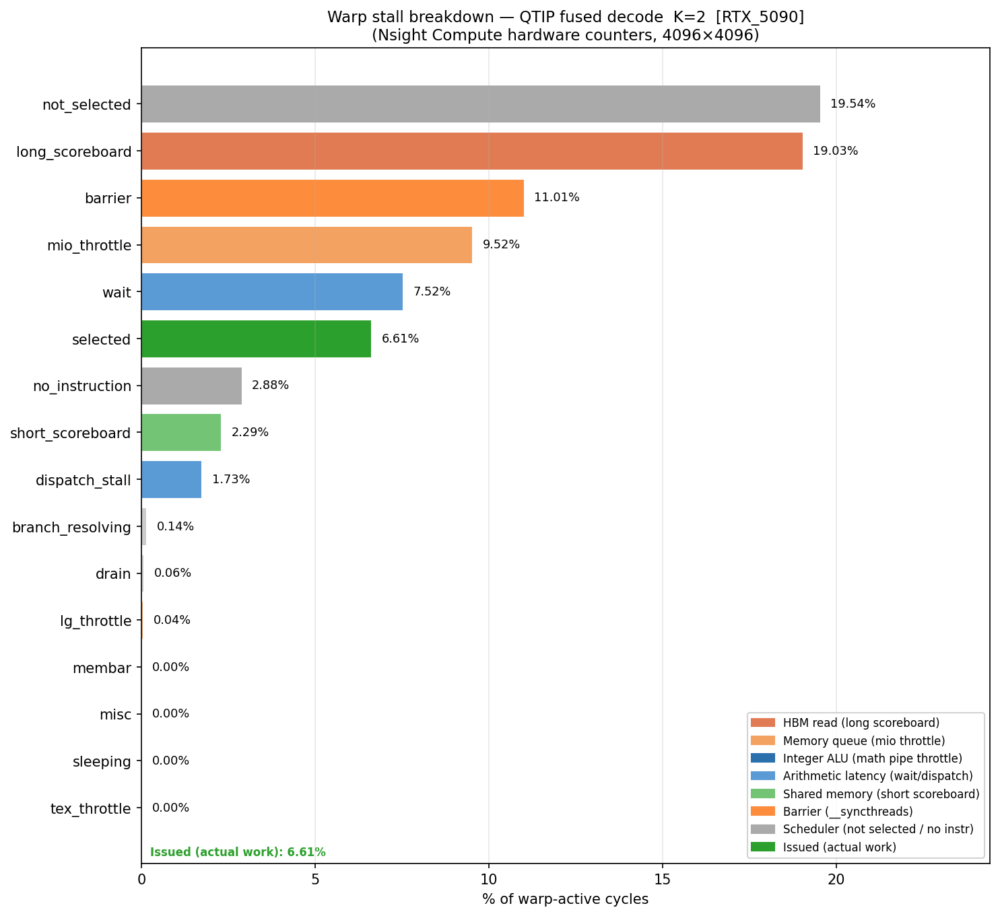

# QTIP Inference Benchmark Report

**Hardware**: NVIDIA RTX 5090 (Blackwell GB202, 170 SMs, ~1.8 TB/s HBM)
**Model**: Single 4096×4096 FP16 weight matrix (one transformer linear layer)
**Bitrates evaluated**: K=2, K=3, K=4 bits per weight

---

## 1. What This Project Does

[QTIP (Quantization with Trellises and Incoherence Processing)](https://arxiv.org/abs/2406.11235) is a
NeurIPS 2024 Spotlight paper that quantizes LLM weights using Trellis Coded Quantization (TCQ).
It applies a Hadamard rotation to make weights approximately i.i.d. Gaussian, then encodes them
as a path through a 65536-state trellis (L=16 shift-register bits), achieving near-Shannon-limit
rate-distortion.

This benchmark evaluates QTIP's inference performance on a single representative weight matrix,
asking: **does the smaller compressed representation actually translate to faster inference?**

Two inference paths are measured:

| Path | Description |
|---|---|
| **Dequant + gemv** | Decode trellis → write full FP16 matrix to VRAM → cuBLAS gemv |
| **Fused matvec** | `decompress_matvec_qtip` kernel: decode trellis and accumulate into output in one pass — the weight matrix is never materialised |

The fused path is QTIP's production inference path inside `BitshiftLinear.forward` for batch=1
(single-token generation). Measurements mirror the full forward pass:
`x_rot = HadUt(x·SU)/scale → out_rot = fused_decode(trellis, x_rot, LUT) → HadU(out_rot)·(SV·Wscale·scale)`.

---

## 2. Quantization Quality

Before measuring speed, we verify that the compressed weights are accurate.



Weight MSE and output MSE both fall sharply with increasing K. At K=4 the output error is ~24,
at K=2 it is ~300 — higher error but a 7.93× compression ratio. K=3 offers a balanced trade-off
at 5.30×. The quality of all three is sufficient for practical LLM use, as reported in the paper.

Quantization itself is slow (minutes per matrix), but it is a one-time offline cost:



The Viterbi trellis search dominates quantization time. This is expected — finding the optimal
path through a 65536-state trellis over 4096×4096 weights is expensive. It is irrelevant to
inference latency.

---

## 3. The First Surprise: Fused Matvec Is Slower Than Dequant

With the weights 4–8× smaller, the expectation is that the fused kernel — which reads only the
compressed representation and never writes the full matrix — should be faster than dequant+gemv,
which reads and writes 32 MB of FP16 weights.

The latency comparison shows the opposite:



| Config | Latency | vs FP16 |
|---|---|---|
| FP16 baseline | 0.023 ms | 1× |
| Dequant K=2 | 0.259 ms | 11× slower |
| Dequant K=3 | 0.290 ms | 13× slower |
| Dequant K=4 | 0.319 ms | 14× slower |
| **Fused K=2** | **0.832 ms** | **36× slower** |
| **Fused K=3** | **0.830 ms** | **36× slower** |
| **Fused K=4** | **0.828 ms** | **36× slower** |

Two observations stand out:

1. **Fused is ~3× slower than dequant**, despite reading 8× less data.
2. **Fused latency is flat across K=2/3/4**, even though K=4 packs twice as many bits per weight
   as K=2 (4 MB vs 8 MB of packed data). More data, same time.

Both observations suggest the fused kernel is not being limited by memory bandwidth at all.

---

## 4. Digging Deeper: Breaking Down Fused Decode Latency

To understand where time is spent, each step of the fused path is timed individually:



The input/output Hadamard rotations and output scaling together take under 0.03 ms. The
`fused_decode` step — the `decompress_matvec_qtip` CUDA kernel — accounts for virtually
all of the 0.83 ms latency.

Within `fused_decode`, two sub-measurements are taken:

- **`packed_read_ms`**: a proxy for the pure HBM read cost, measured by forcing all packed bytes
  through the memory hierarchy without any decode (`packed.sum()`). This gives a floor — the
  minimum time the kernel could possibly take if memory were the only bottleneck.
- **`decode_overhead_ms = fused_decode_ms − packed_read_ms`**: the compute cost on top of
  that memory floor.

| K | fused_decode | packed_read (HBM floor) | decode_overhead (compute) |
|---|---|---|---|
| 2 | 0.849 ms | 0.024 ms | 0.825 ms |
| 3 | 0.840 ms | 0.028 ms | 0.813 ms |
| 4 | 0.841 ms | 0.031 ms | 0.810 ms |

The HBM floor is tiny (0.024–0.031 ms). The decode overhead is ~0.82 ms — **97% of the kernel
time is spent above the memory bandwidth floor**. This rules out HBM bandwidth saturation as the
cause and points firmly at the decode computation itself.

The flat latency across K now also makes sense: the number of weights to decode is fixed at
4096×4096 = 16M regardless of K. Only the bit-width per weight changes, not the number of
trellis steps.

---

## 5. Inside the Kernel: Phase Breakdown

To see where within the decode kernel time is spent, the CUDA kernel was instrumented with
`%globaltimer` (a GPU-side nanosecond counter) at three checkpoints:

- **LUT load**: one-time initialisation of the 64 KB codebook into shared memory
- **Decode loop**: the ki loop — trellis unpack, LUT lookup, MMA accumulate
- **Reduction**: warp-level reduce and output write

The raw timer values are proportionally scaled to the wall-clock `fused_decode_ms`:



The decode loop accounts for ~85% of kernel time. The LUT load (~10%) is non-trivial — loading
64 KB from HBM into shared memory at the start of each block execution. Reduction is ~3%.

This confirms the decode loop is where investigation should focus.

---

## 6. Root Cause: Nsight Compute Warp Stall Analysis

With the decode loop identified as the bottleneck, Nsight Compute hardware performance counters
are used to measure exactly what the GPU warps are stalled on during that loop:



The stall breakdown for K=2 (representative; K=3/4 are nearly identical):

| Stall | % of warp-active cycles | Meaning |
|---|---|---|
| `math_pipe_throttle` | **22.78%** | Integer ALU pipeline saturated |
| `not_selected` | 19.54% | Warp ready but scheduler chose another |
| `long_scoreboard` | 19.03% | Waiting for HBM/L2 load to return |
| `barrier` | 11.01% | Waiting at `__syncthreads()` |
| `mio_throttle` | 9.52% | Memory instruction queue saturated |
| `wait` | 7.52% | Waiting for previous arithmetic result |
| `short_scoreboard` | 2.29% | Waiting for shared memory (LUT lookup) |
| **`selected`** | **6.61%** | **Actually issuing an instruction (real work)** |

**Only 6.61% of cycles are doing real work.** Everything else is waiting.

### Why — connected to how QTIP works

The bottleneck is not any single resource. It is a structural consequence of the trellis algorithm itself.

QTIP encodes each weight as a transition in a 65536-state Markov chain. The quality of compression
comes from this trellis having *memory* — each weight is encoded in the context of all previous
weights in the row. At decode time this becomes:

```
state[i]  →  extract R bits  →  compute LUT index  →  LUT lookup  →  MMA  →  state[i+1]  →  ...
```

Every step depends on the one before it. **This serial chain is not an implementation choice —
it is the mathematical definition of trellis-coded quantization.**

The chain drives every stall in the table:

- **`math_pipe_throttle` (22.78%)**: The LUT index computation — `idx = reg_c >> (R·j)`,
  `idx = idx*(idx+1)`, `masked_idx = (idx & mask) | lane_id` — is a sequence of integer
  instructions that saturates the ALU pipeline. This is the bitshift trellis arithmetic from
  the paper. Each index calculation must complete before the LUT lookup can begin.

- **`long_scoreboard` + `mio_throttle` (28.55%)**: Each warp has only 4 ki iterations
  (shallow work depth). With few concurrent in-flight HBM requests (~64–128 KB), the GPU
  cannot hide HBM's ~200 ns per-request latency. Note: this is a *latency* problem, not a
  *bandwidth* problem. The 4 MB of packed data could theoretically be read in ~2 µs at peak
  bandwidth — but with insufficient request concurrency, individual warps stall waiting for
  their specific loads.

- **`barrier` (11.01%)**: The 64 KB shared memory LUT (512 codebook entries × 32-lane
  replication to avoid bank conflicts) exhausts the shared memory budget, limiting the kernel
  to **1 block per SM**. This makes the two `__syncthreads()` calls (codebook load and
  reduction) expensive — there are no other resident blocks to overlap with.

- **`not_selected` (19.54%)**: A scheduling consequence of the above. With most warps stalled
  on one of the above reasons, only 2.07 of the 7.90 active warps per scheduler are eligible
  at any given cycle. When multiple warps are simultaneously eligible, one issues and the
  others get `not_selected`. This is not itself a bottleneck — it reflects that the deeper
  stalls have already reduced eligible-warp count too far to fully hide latency.

### Why this also explains the comparison with dequant and FP16

cuBLAS (used by both FP16 gemv and the dequant path) reads its weight matrix as a stream of
fully independent values. There is no serial dependency — every load and multiply is
independent of every other. This lets cuBLAS keep thousands of memory requests and multiply
operations in-flight simultaneously across all 170 SMs, achieving near-peak bandwidth and
near-peak Tensor Core utilisation.

The fused QTIP kernel reads 8× less data but processes each byte through a serial, dependent
decode chain. The GPU cannot find independent work to fill its pipelines while waiting.
Quantization reduced the byte count but replaced bandwidth cost with serial dependency cost —
on current hardware, that exchange is deeply unfavourable for batch=1 inference.

### The one-sentence summary

> QTIP's compression quality comes from inter-weight trellis dependencies; GPU throughput comes
> from operation independence. These two properties are in fundamental conflict, leaving 93.4%
> of warp cycles idle on the RTX 5090.
